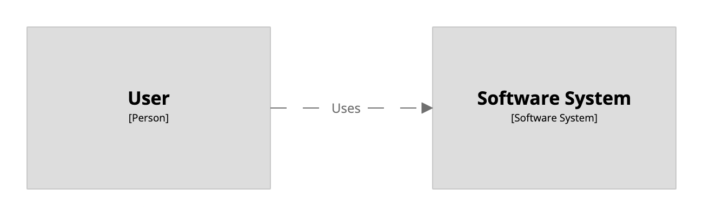

# Structurizr DSL

This GitHub repository contains an implementation of the Structurizr DSL - a way to create Structurizr software architecture models based upon the [C4 model](https://c4model.com) using a textual domain specific language (DSL).

Go the url: https://structurizr.com/

## 

## A quick example

As an example, the following text can be used to create a software architecture __model__ and
an associated __view__ that describes a user using a software system.

```
workspace {

    model {
        user = person "User"
        softwareSystem = softwareSystem "Software System"

        user -> softwareSystem "Uses"
    }

    views {
        systemContext softwareSystem {
            include *
            autolayout lr
        }
    }
    
}
```



---

# Language reference

The Structurizr DSL provides a way to define a software architecture model
(based upon the [C4 model](https://c4model.com)) as text, using a domain specific language (DSL).

## Table of contents

- [Structurizr DSL](#structurizr-dsl)
  - [](#)
  - [A quick example](#a-quick-example)
- [Language reference](#language-reference)
  - [Table of contents](#table-of-contents)
  - [General rules](#general-rules)
  - [Comments](#comments)
  - [Identifiers](#identifiers)
  - [Grammar](#grammar)
    - [workspace](#workspace)
    - [model](#model)
    - [group](#group)
    - [person](#person)
    - [softwareSystem](#softwaresystem)
    - [container](#container)
    - [component](#component)
    - [deploymentEnvironment](#deploymentenvironment)
    - [deploymentGroup](#deploymentgroup)
    - [deploymentNode](#deploymentnode)
    - [infrastructureNode](#infrastructurenode)
    - [softwareSystemInstance](#softwaresysteminstance)
    - [containerInstance](#containerinstance)
    - [healthCheck](#healthcheck)
    - [element](#element)
    - [relationship](#relationship)
    - [tags](#tags)
    - [description](#description)
    - [technology](#technology)
    - [instances](#instances)
    - [url](#url)
    - [properties](#properties)
    - [perspectives](#perspectives)
    - [!ref](#ref)
    - [views](#views)
    - [systemLandscape view](#systemlandscape-view)
    - [systemContext view](#systemcontext-view)
    - [container view](#container-view)
    - [component view](#component-view)
    - [filtered view](#filtered-view)
    - [dynamic view](#dynamic-view)
    - [deployment view](#deployment-view)
    - [custom view](#custom-view)
    - [image view](#image-view)
    - [include](#include)
      - [Including elements](#including-elements)
    - [exclude](#exclude)
      - [Excluding elements](#excluding-elements)
      - [Excluding relationships](#excluding-relationships)
    - [autoLayout](#autolayout)
    - [default](#default)
    - [animation](#animation)
    - [title](#title)
    - [styles](#styles)
    - [element style](#element-style)
    - [relationship style](#relationship-style)
    - [theme](#theme)
    - [themes](#themes)
    - [branding](#branding)
    - [terminology](#terminology)
    - [configuration](#configuration)
    - [users](#users)

## General rules

- Keywords are case-insensitive (e.g. you can use `softwareSystem` or `softwaresystem`).


## Comments

Comments can be defined as follows:

```
/*
    multi-line comment
*/
```

```
/* single-line comment */
```

```
# single line comment
```

```
// single line comment
```

## Identifiers

By default, all elements and relationships are anonymous, in that they can't be referenced from within the DSL. For example, the following statements will create a person and a software system, but neither can be referenced within the DSL.

```
person "User"
softwareSystem "Software System"
```

To create a relationship between the two elements, we need to be able to reference them. We can do this by defining an identifier, in the same way that you'd define a variable in many programming languages.

```
p = person "User"
ss = softwareSystem "Software System"
```

Now we can use these identifiers when creating relationships, specifying which elements should be included/excluded from views, etc.

```
p -> ss "Uses"
```

Relationships can also be assigned an identifier.

```
rel = p -> ss "Uses"
```

Identifiers are only needed where you plan to reference the element/relationship. The following characters may be used when defining an identifier: `a-zA-Z_0-9`

## Grammar

The following describes the language grammar, with angle brackets (`<...>`) used to show required properties, and square brackets (`[...]`) used to show optional properties.
Most statements are of the form: `keyword <required properties> [optional properties]`

### workspace

`workspace` is the top level language construct, and the wrapper for the [model](#model) and [views](#views). A workspace can optionally be given a name and description.

```
workspace [name] [description] {
    ...
}
```

Permitted children:

- name <name>
- description <description>
- [properties](#properties)
- !docs
- !adrs
- [!identifiers](#identifier-scope)
- !impliedRelationships
- [model](#model)
- [views](#views)
- [configuration](#configuration)

### model

Each workspace must contain a `model` block, inside which elements and relationships are defined.

```
model {
    ...
}
```

Permitted children:

- [group](#group)
- [person](#person)
- [softwareSystem](#softwareSystem)
- [deploymentEnvironment](#deploymentEnvironment)
- [element](#element)
- [-> (relationship)](#relationship)

### group

The `group` keyword provides a way to define a named grouping of elements, which will be rendered as a boundary around those elements.

```
group <name> {
    ...
}
```

Groups can only be used to group elements of the same type (i.e. the same level of abstraction), as follows:

| Location        | Permitted elements          |
|-----------------|-----------------------------|
| Model           | People and software systems |
| Software System | Containers                  |
| Container       | Components                  |

See [Structurizr - Help - Notation](https://structurizr.com/help/notation) for a description of which groups are shown for a given diagram type.

### person

The `person` keyword defines a person (e.g. a user, actor, role, or persona).

```
person <name> [description] [tags] {
    ...
}
```

The following tags are added by default:

- `Element`
- `Person`

Permitted children:

- [description](#description)
- [tags](#tags)
- [url](#url)
- [properties](#properties)
- [perspectives](#perspectives)
- [-> (relationship)](#relationship)

### softwareSystem

The `softwareSystem` keyword defines a software system.

```
softwareSystem <name> [description] [tags] {
    ...
}
```

The following tags are added by default:

- `Element`
- `Software System`

Permitted children:

- !docs
- !adrs
- [group](#group)
- [container](#container)
- [description](#description)
- [tags](#tags)
- [url](#url)
- [properties](#properties)
- [perspectives](#perspectives)
- [-> (relationship)](#relationship)

### container

The `container` keyword defines a container, within a software system.

```
container <name> [description] [technology] [tags] {
    ...
}
```

The following tags are added by default:

- `Element`
- `Container`

Permitted children:

- !docs
- !adrs
- [group](#group)
- [component](#component)
- [description](#description)
- [technology](#technology)
- [tags](#tags)
- [url](#url)
- [properties](#properties)
- [perspectives](#perspectives)
- [-> (relationship)](#relationship)

### component

The `component` keyword defines a component, within a container.

```
component <name> [description] [technology] [tags] {
    ...
}
```

The following tags are added by default:

- `Element`
- `Component`

Permitted children:

- !docs
- !adrs
- [description](#description)
- [technology](#technology)
- [tags](#tags)
- [url](#url)
- [properties](#properties)
- [perspectives](#perspectives)
- [-> (relationship)](#relationship)

### deploymentEnvironment

The `deploymentEnvironment` keyword provides a way to define a deployment environment (e.g. development, testing, staging, live, etc).

```
deploymentEnvironment <name> {
    ...
}
```

Permitted children:

- [group](#group)
- [deploymentGroup](#deploymentGroup)
- [deploymentNode](#deploymentNode)
- [-> (relationship)](#relationship)

### deploymentGroup

The `deploymentGroup` keyword provides a way to define a named deployment group.

```
deploymentGroup <name>
```

When software system/container instances are added to a deployment environment, all of the relationships between these elements are automatically replicated between *all* instances. Deployment groups provide a way to restrict the scope in which relationships are replicated.

### deploymentNode

The `deploymentNode` keyword is used to define a deployment node.

```
deploymentNode <name> [description] [technology] [tags] [instances] {
    ...
}
```

The following tags are added by default:

- `Element`
- `Deployment Node`

Permitted children:

- [group](#group)
- [deploymentNode](#deploymentNode) (deployment nodes can be nested)
- [infrastructureNode](#infrastructureNode)
- [softwareSystemInstance](#softwareSystemInstance)
- [containerInstance](#containerInstance)
- [-> (relationship)](#relationship)
- [description](#description)
- [technology](#technology)
- [instances](#instances)
- [tags](#tags)
- [url](#url)
- [properties](#properties)
- [perspectives](#perspectives)

### infrastructureNode

The `infrastructureNode` keyword defines an infrastructure node, which is typically something like a load balancer, firewall, DNS service, etc.

```
infrastructureNode <name> [description] [technology] [tags] {
    ...
}
```

The following tags are added by default:

- `Element`
- `Infrastructure Node`

Permitted children:

- [-> (relationship)](#relationship)
- [description](#description)
- [technology](#technology)
- [tags](#tags)
- [url](#url)
- [properties](#properties)
- [perspectives](#perspectives)

### softwareSystemInstance

The `softwareSystemInstance` keyword defines an instance of the specified software system that is deployed on the parent deployment node.

```
softwareSystemInstance <identifier> [deploymentGroups] [tags] {
    ...
}
```

The `identifier` must represent a software system. `deploymentGroups` is a comma seperated list of identifiers representing deployment groups.

In addition to the software system's tags, the following tags are added by default:

- `Software System Instance`

Permitted children:

- [-> (relationship)](#relationship)
- [description](#description)
- [tags](#tags)
- [url](#url)
- [properties](#properties)
- [perspectives](#perspectives)
- [healthCheck](#healthCheck)

### containerInstance

The `containerInstance` keyword defines an instance of the specified container that is deployed on the parent deployment node.

```
containerInstance <identifier> [deploymentGroups] [tags] {
    ...
}
```

The `identifier` must represent a container. `deploymentGroups` is a comma seperated list of identifiers representing deployment groups.

In addition to the container's tags, the following tags are added by default:

- `Container Instance`

Permitted children:

- [-> (relationship)](#relationship)
- [description](#description)
- [tags](#tags)
- [url](#url)
- [properties](#properties)
- [perspectives](#perspectives)
- [healthCheck](#healthCheck)

### healthCheck

The `healthCheck` keyword defines a HTTP health check for the parent software system/container instance.

```
healthCheck <name> <url> [interval] [timeout]
```

The interval is a number of seconds (default 60s), and the timeout is a number of milliseconds (default 0ms).

### element

The `element` keyword defines a [custom element](https://structurizr.com/help/custom-elements) (this is only available on the Structurizr cloud service/on-premises installation/Lite).

```
element <name> [metadata] [description] [tags] {
    ...
}
```

The following tags are added by default:

- `Element`

Permitted children:

- [description](#description)
- [tags](#tags)
- [url](#url)
- [properties](#properties)
- [perspectives](#perspectives)
- [-> (relationship)](#relationship)

### relationship

`->` is used to define a uni-directional relationship between two elements.

There are two ways to define relationships. The first is explicitly, where you explicitly use a source identifier:

```
<identifier> -> <identifier> [description] [technology] [tags] {
    ...
}
```

For example:

```
user -> softwareSystem "Uses"
```

And the second is implicitly, where the relationship source is the element in scope:

```
-> <identifier> [description] [technology] [tags]
```

For example:

```
person user {
    -> softwareSystem "Uses"
}
```

This is equivalent to the following, where the special `this` identifier is used to refer to the element in scope:

```
person user {
    this -> softwareSystem "Uses"
}
```

The following tags are added to relationships by default:

- `Relationship`

The following types of relationships can be created using the DSL:

| Source  | Destination |
| ------------- | ------------- |
| Person | Person, Software System, Container, Component |
| Software System | Person, Software System, Container, Component |
| Container | Person, Software System, Container, Component |
| Component | Person, Software System, Container, Component |
| Deployment Node | Deployment Node |
| Infrastructure Node | Deployment Node, Infrastructure Node, Software System Instance, Container Instance |
| Software System Instance | Infrastructure Node |
| Container Instance | Infrastructure Node |

Permitted children:

- [tags](#tags)
- [url](#url)
- [properties](#properties)
- [perspectives](#perspectives)

### tags

`tags` is used to add tags to an element or relationship. Tags can be specified comma separated, or individually.

```
tags "Tag 1"
tags "Tag 1,Tag 2"
tags "Tag 1" "Tag 2"
```

### description

`description` is used to set the description on an element or view.

```
description "Description"
```

### technology

`technology` is used to set the technology on a container, component, deployment node, infrastructure node.

```
technology "Technology"
```

### instances

`instances` is used to set the number of instances of a deployment node.
This can either be a static number, or a range (e.g. 0..1, 1..3, 5..10, 0..N, 0..*, 1..N, 1..*, etc).

```
instances "4"
```

```
instances "1..N"
```

### url

`url` is used to set a URL on an element or relationship.

```
url https://example.com
```

### properties

The `properties` block is used to define one or more name/value properties.

```
properties {
    <name> <value>
    ...
}
```

### perspectives

The `perspectives` block is used to define one or more name/description perspectives for an element or relationship.
See [Help - Perspectives](https://structurizr.com/help/perspectives) for how these are used.

```
perspectives {
    <name> <description>
    ...
}
```

### !ref

The `!ref` keyword provides a way to reference a previously defined element/relationship, and is designed to be used with the workspace `extends` or `!include` features. It can be used in a couple of ways.

The first usage scenario is to reference an existing element/relationship that has been defined via the DSL. This allows you to extend the element referenced by the given identifier.

```
!ref <identifier> {
  ...
}
```

### views

Each workspace can also contain one or more views, defined with the `views` block.

```
views {
    ...
}
```

The `views` block can contain the following:

- [systemLandscape](#systemLandscape-view)
- [systemContext](#systemContext-view)
- [container](#container-view)
- [component](#component-view)
- [filtered](#filtered-view)
- [dynamic](#dynamic-view)
- [deployment](#deployment-view)
- [custom](#custom-view)
- [image](#image-view)
- [styles](#styles)
- [theme](#theme)
- [themes](#themes)
- [branding](#branding)
- [terminology](#terminology)
- [properties](#properties)

### systemLandscape view

The `systemLandscape` keyword is used to define a [System Landscape view](https://c4model.com/#SystemLandscapeDiagram).

```
systemLandscape [key] [description] {
    ...
}
```

Permitted children:

- [include](#include)
- [exclude](#exclude)
- [autoLayout](#autoLayout)
- [default](#default)
- [animation](#animation)
- [title](#title)
- [description](#description)
- [properties](#properties)

### systemContext view

The `systemContext` keyword is used to define a [System Context view](https://c4model.com/#SystemContextDiagram) for the specified software system.

```
systemContext <software system identifier> [key] [description] {
    ...
}
```

Permitted children:

- [include](#include)
- [exclude](#exclude)
- [autoLayout](#autoLayout)
- [default](#default)
- [animation](#animation)
- [title](#title)
- [description](#description)
- [properties](#properties)

### container view

The `container` keyword is used to define a [Container view](https://c4model.com/#ContainerDiagram) for the specified software system.

```
container <software system identifier> [key] [description] {
    ...
}
```

Permitted children:

- [include](#include)
- [exclude](#exclude)
- [autoLayout](#autoLayout)
- [default](#default)
- [animation](#animation)
- [title](#title)
- [description](#description)
- [properties](#properties)

### component view

The `component` keyword is used to define a [Component view](https://c4model.com/#ComponentDiagram) for the specified container.

```
component <container identifier> [key] [description] {
    ...
}
```

Permitted children:

- [include](#include)
- [exclude](#exclude)
- [autoLayout](#autoLayout)
- [default](#default)
- [animation](#animation)
- [title](#title)
- [description](#description)
- [properties](#properties)

### filtered view

The `filtered` keyword is used to define a [Filtered view](https://structurizr.com/help/filtered-views) on top of the specified view.

```
filtered <baseKey> <include|exclude> <tags> [key] [description] {
    ...
}
```

The `baseKey` specifies the key of the System Landscape, System Context, Container, or Component view on which this filtered view should be based. The mode (`include` or `exclude`) defines whether the view should include or exclude elements/relationships based upon the `tags` provided.

Please note that once a filtered view is defined for a given "base view", that base view will no longer show up in your diagram list when using the Structurizr renderer. This is by design. If you'd like to see the base view too, just create another filtered view for the same base view, which includes the `Element` and `Relationship` tags.

Permitted children:

- [default](#default)
- [title](#title)
- [description](#description)
- [properties](#properties)

```
filtered <baseKey> include "Element,Relationship" [key] [description]
```

### dynamic view

The `dynamic` keyword defines a [Dynamic view](https://c4model.com/#DynamicDiagram) for the specified scope.

```
dynamic <*|software system identifier|container identifier> [key] [description] {
    ...
}
```

The first property defines the scope of the view, and therefore what can be added to the view, as follows:

- `*` scope: People and software systems.
- Software system scope: People, other software systems, and containers.
- Container scope: People, other software systems, other containers, and components.

Unlike the other diagram types, Dynamic views are created by specifying the relationships that should be added to the view, within the `dynamic` block, as follows:

```
<element identifier> -> <element identifier> [description] [technology]
<relationship identifier> [description]
```

Permitted children:

- [autoLayout](#autoLayout)
- [default](#default)
- [title](#title)
- [description](#description)
- [properties](#properties)

### deployment view

The `deployment` keyword defines a [Deployment view](https://c4model.com/#DeploymentDiagram) for the specified scope and deployment environment.

```
deployment <*|software system identifier> <environment> [key] [description] {
    ...
}
```

The first property defines the scope of the view, and the second property defines the deployment environment (which can be an identifier, or a name). The combination of these two properties determines what can be added to the view, as follows:

- `*` scope: All deployment nodes, infrastructure nodes, and container instances within the deployment environment.
- Software system scope: All deployment nodes and infrastructure nodes within the deployment environment. Container instances within the deployment environment that belong to the software system.

Permitted children:

- [include](#include)
- [exclude](#exclude)
- [autoLayout](#autoLayout)
- [default](#default)
- [animation](#animation)
- [title](#title)
- [description](#description)
- [properties](#properties)

### custom view

The `custom` keyword is used to define a [custom view](https://structurizr.com/help/custom-diagrams) (this is only available on the Structurizr cloud service/on-premises installation/Lite).

```
custom [key] [title] [description] {
    ...
}
```

Permitted children:

- [include](#include)
- [exclude](#exclude)
- [autoLayout](#autoLayout)
- [default](#default)
- [animation](#animation)
- [title](#title)
- [description](#description)
- [properties](#properties)

### image view

The `image` keyword is used to define an [image view](https://structurizr.com/help/image-views) (this is only available on the Structurizr cloud service/on-premises installation/Lite).

```
image <*|element identifier> [key] {
    ...
}
```

Inside this block you can define the source of the image, using one of the following:

- `plantuml <file|url>`
- `mermaid <file|url>`
- `kroki <format> <file|url>` (where `format` is the format identifier included in the URL path; e.g. `https://kroki.io/{format}/...`)
- `image <file|url>`

You will need to provide a PlantUML/Mermaid/Kroki URL, and optionally a format (`png` or `svg`),
when using these services. These can be specified as view set properties:

```
views {
    properties {
        "plantuml.url" "http://localhost:7777"
        "plantuml.format" "svg"
        "mermaid.url" "http://localhost:8888"
        "mermaid.format" "svg"
        "kroki.url" "http://localhost:9999"
        "kroki.format" "svg"
    }
    
    ...
}
```

Permitted children:

- [default](#default)
- [title](#title)
- [description](#description)
- [properties](#properties)

### include

The `include` keyword can be used to include elements or relationships.

#### Including elements

To include elements in a view, use one or more `include` statements inside the block defining the view.

```
include <*|identifier|expression> [*|identifier|expression...]
```

Elements can either be specified using individual identifiers, the wildcard identifier (`*`), or a property expression. Please note that including elements will also include the relationships between those elements.

The wildcard identifier (`*`) operates differently depending upon the type of diagram, as follows:

- System Landscape view: Include all people and software systems.
- System Context view: Include the software system in scope; plus all people and software systems that are directly connected to the software system in scope.
- Container view: Include all containers within the software system in scope; plus all people and software systems that are directly connected to those containers.
- Component view: Include all components within the container in scope; plus all people, software systems and containers (belonging to the software system in scope) directly connected to them.
- Filtered view: (not applicable)
- Dynamic view: (not applicable)
- Deployment view: Include all deployment nodes, infrastructure nodes, and container instances defined within the deployment environment and (optional) software system in scope.

### exclude

The `exclude` keyword can be used to exclude elements or relationships.

#### Excluding elements

To exclude specific elements, use one or more `exclude` statements inside the block defining the view.

```
exclude <identifier|expression> [identifier|expression...]
```

#### Excluding relationships

To exclude a relationship in a view, you can specify an individual relationship identifier, or use a property expression:

```
exclude <identifier|expression> [identifier|expression...]
```

### autoLayout

To enable automatic layout mode for the diagram, use the `autoLayout` statement inside the block defining the view.

```
autoLayout [tb|bt|lr|rl] [rankSeparation] [nodeSeparation]
```

The first property is the rank direction:

- `tb`: Top to bottom (default)
- `bt`: Bottom to top
- `lr`: Left to right
- `rl`: Right to left

The second property is the separation of ranks in pixels (default: `300`), while the third property is the separation of nodes in the same rank in pixels (default: `300`).

### default

Sets the default view to be shown.

```
default
```

### animation

The `animation` keyword defines the animation for the specified view.
Each animation step should be defined on a separate line, inside the block, specifying the elements that should be included in that step.

```
animation {
    <identifier> [identifier...]
    <identifier> [identifier...]
}
```

### title

Overrides the title of the view.

```
title <title>
```

### styles

`styles` is the wrapper for one or more element/relationship styles, which are used when rendering diagrams.

```
styles {
    ...
}
```

Permitted children:

- [element](#element-style)
- [relationship](#relationship-style)

### element style

The `element` keyword is used to define an element style.
All nested properties (`shape`, `icon`, etc) are optional.

```
element <tag> {
    shape <Box|RoundedBox|Circle|Ellipse|Hexagon|Cylinder|Pipe|Person|Robot|Folder|WebBrowser|MobileDevicePortrait|MobileDeviceLandscape|Component>
    icon <file|url>
    width <integer>
    height <integer>
    background <#rrggbb|color name>
    color <#rrggbb|color name>
    colour <#rrggbb|color name>
    stroke <#rrggbb|color name>
    strokeWidth <integer: 1-10>
    fontSize <integer>
    border <solid|dashed|dotted>
    opacity <integer: 0-100>
    metadata <true|false>
    description <true|false>
    properties {
        name value
    }
}
```

Notes:

- Colors can be specified as a hex code (e.g. `#ffff00`) or a CSS/HTML named color (e.g. `yellow`).
- See [Help - Icons](https://structurizr.com/help/icons) for information about HTTPS/CORS if you are using the Structurizr cloud service/on-premises installation/Lite and specifying an element style icon via a URL.
- Element styles are designed to work with the Structurizr cloud service/on-premises installation/Lite, and may not be fully supported by the [PlantUML, Mermaid, etc export formats](https://github.com/structurizr/export) (e.g. shapes and icons).

### relationship style

The `relationship` keyword is used to define a relationship style.
All nested properties (`thickness`, `color`, etc) are optional.

```
relationship <tag> {
    thickness <integer>
    color <#rrggbb|color name>
    colour <#rrggbb|color name>
    style <solid|dashed|dotted>
    routing <Direct|Orthogonal|Curved>
    fontSize <integer>
    width <integer>
    position <integer: 0-100>
    opacity <integer: 0-100>
    properties {
        name value
    }
}
```

Notes:

- Colors can be specified as a hex code (e.g. `#ffff00`) or a CSS/HTML named color (e.g. `yellow`).
- Relationship styles are designed to work with the Structurizr cloud service/on-premises installation/Lite, and may not be fully supported by the [PlantUML, Mermaid, etc export formats](https://github.com/structurizr/export) (e.g. line/arrow colours).

### theme

The `theme` keyword can be used to specify a theme that should be used when rendering diagrams. See [Structurizr - Themes](https://structurizr.com/help/themes) for more details.

```
theme <default|url>
```

`default` can be used as a theme URL, to include [the default Structurizr theme](https://structurizr.com/help/theme?url=https://static.structurizr.com/themes/default/theme.json).

### themes

The `themes` keyword can be used to specify one or more themes that should be used when rendering diagrams. See [Structurizr - Themes](https://structurizr.com/help/themes) for more details.

```
themes <url> [url] ... [url]
```

`default` can be used as a theme URL, to include [the default Structurizr theme](https://structurizr.com/help/theme?url=https://static.structurizr.com/themes/default/theme.json).

### branding

The `branding` keyword allows you to define some custom branding that should be used when rendering diagrams and documentation. See [Structurizr - Branding](https://structurizr.com/help/branding) for more details.

```
branding {
    logo <file|url>
    font <name> [url]
}
```

Notes:

- See [Help - Icons](https://structurizr.com/help/icons) for information about HTTPS/CORS if you are using the Structurizr cloud service/on-premises installation/Lite and specifying a branding icon via a URL.

### terminology

The `terminology` keyword allows you to override the terminology used when rendering diagrams.

```
terminology {
    person <term>
    softwareSystem <term>
    container <term>
    component <term>
    deploymentNode <term>
    infrastructureNode <term>
    relationship <term>
}
```

### configuration

Finally, there are some configuration options that can be specified inside the `configuration` block.

```
configuration {
    ...
}
```

Permitted children:

- [users](#users)
- [properties](#properties)

### users

The `users` block can be used to specify the users who should have read-only or read-write access to a workspace. Each username (e.g. e-mail address) and role pair should be specified on their own line. Valid roles are `read` (read-only) and `write` (read-write).

```
users {
    <username> <read|write>
}
```